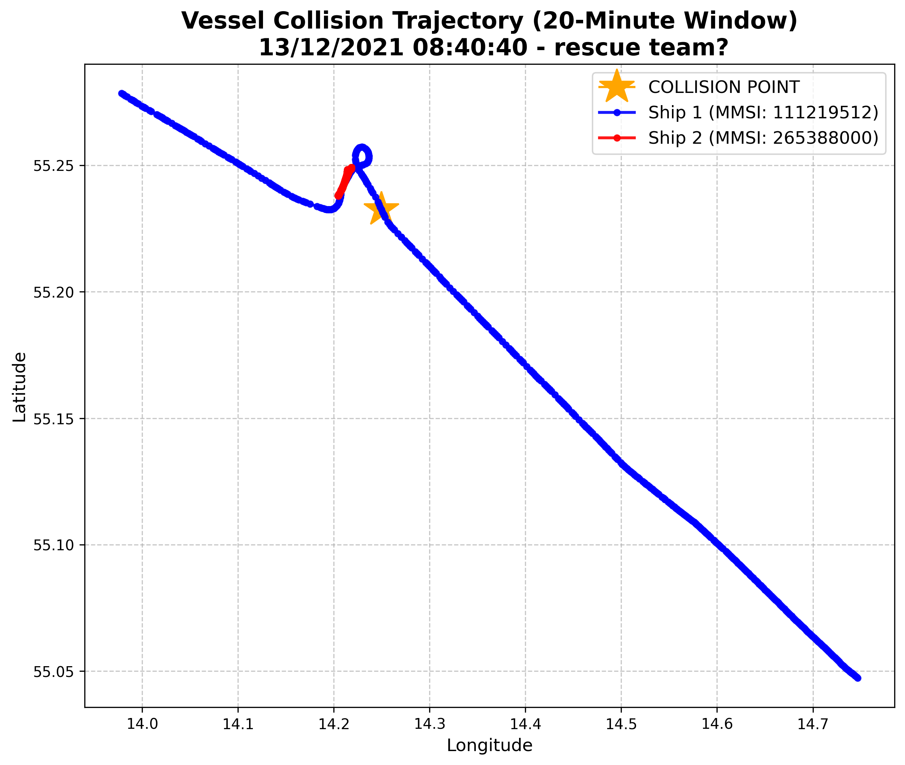
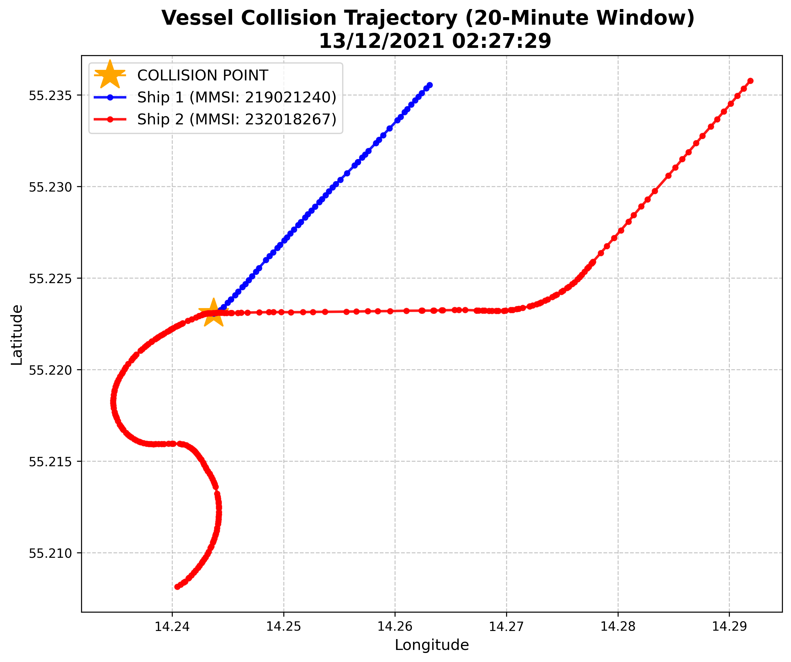

# **Big Data Assignment #4 REPORT: Detection of Vessel Collisions**

## 1. Methodology: defining and excluding data noise
Raw AIS data is very noisy. To find a true collision without crashing the system via an unoptimized Cartesian product, the pipeline applies several layers of logic:

* **Stand-still ships:** filtered out any ships with a Speed Over Ground (SOG) of less than 4.0 knots. This removed anchored ships, docked ships, and slow-speed pilot transfers, ensuring only looking at active transit.
* **Ghost pings / teleportation:** Sometimes a ship's GPS glitches and "teleports" across the map. It was required for a ship to have at least 20 valid pings inside our 50nm radius. If a ship had only 1 ping, it was a glitch, and it was removed.
* **Closely sailing towing / convoys:** Tugboats and barges sail close to each other for hours. The maximum and minimum distance of an encounter in a 15-minute window was calculated. It was required that the ships approach each other from at least 0.5 nautical miles away, which filtered out safe convoys.

## 2. Computational strategy and optimization
Comparing every single ship's coordinate to every other ship's coordinate would be computationally impossible. To optimize the cost:
1. **Early geographic filtering:** applied 50-nautical-mile radius filter before joining any data. 
2. **Spatial indexing (grid):** rounded the coordinates to an ~11km grid and created 15-minute time bins. 
3. **Join:** only joined and calculated exact physical distances for ship pairs that shared the same grid box at the exact same time; it reduced the computational load.

## 3. Verifying the collision & the "going dark" assumption
To isolate the final crash, assumed a serious-to-catastrophic collision would destroy a ship's transponder. I implemented a **"signal death"** filter, requiring at least one ship's data to cease immediately upon impact.

**Why this was necessary:**
Without the "going dark" filter, the algorithm finds other high-speed encounters instead, that do not have normal collision-like features (most of the time no smooth trajectories, no noticeable changes after impact, etc.). When tested without it, for example, the algorithm highlighted coordinates `55.232507, 14.249612` at `08:40:40` AM (`MMSI 111219512`). This was several hours after the actual crash found later with the filter, and I managed to find information on the web that MMSI numbers starting with `111` could potentially belong to search/rescue vehicles. So finally, the "going dark" assumption was mathematically necessary to separate the crash from the outputs that, when plotted, did not seem like real crashes at all. The mentioned `08:40:40` AM event (not crash-like) gave this graph, inconsistent with two-ship collision logic:

## 4. Final results and visualization
With the assumptions used, the code successfully isolated a truly real-looking collision behavior:
* **Ship 1:** MMSI 219021240 
* **Ship 2:** MMSI 232018267 
* **Collision Time:** 13/12/2021 02:27:29
* **Coordinates:** Latitude 55.223067, Longitude 14.243730

### Trajectory Analysis
Below is the plotted trajectory of the two vessels over a 20-minute window (10 minutes prior, 10 minutes post-collision). 

**Observation:** The visualization shows Ship 2 (Red) striking Ship 1 (Blue) at the orange star point. At the point of impact, Ship 1's data completely stops/vanishes (it went dark), while Ship 2 continues forward in a bit of a "disoriented" way. This seems very logical when imagining a real-world collision/crash. The `MMSI 111...`, that was briefly detection described before, could even strenghten this case, as a rescue team would probably be required after a real serious collision event.

## 5. Limitations
I acknowledge that assuming a ship must go dark is not entirely realistic for all crash scenarios. For example, two massive cargo ships can crash, cause significant structural damage, and both sail away with working GPS and AIS antennas. By strictly enforcing this filter, the current algorithm would likely miss a more simple collision scenario. However, because pure kinematic physics had difficulty finding a realistic crash (from the generated graph perspective, which looked more messy and unreliable before), this filter was a necessary compromise to accurately identify a crash that resembles a real-life possibility with all the pre and post collision behaviors.
##

**Author:**
\
Ieva Vaškelytė, ieva.vaskelyte@mif.stud.vu.lt
